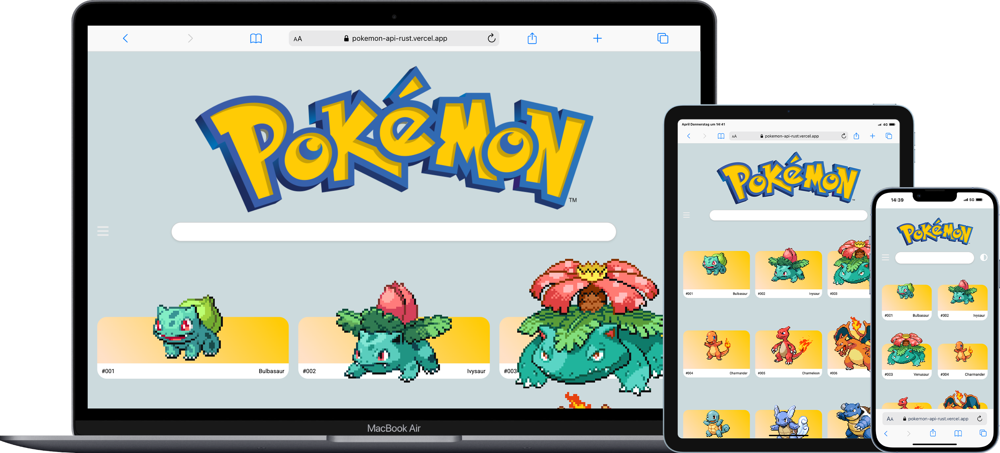
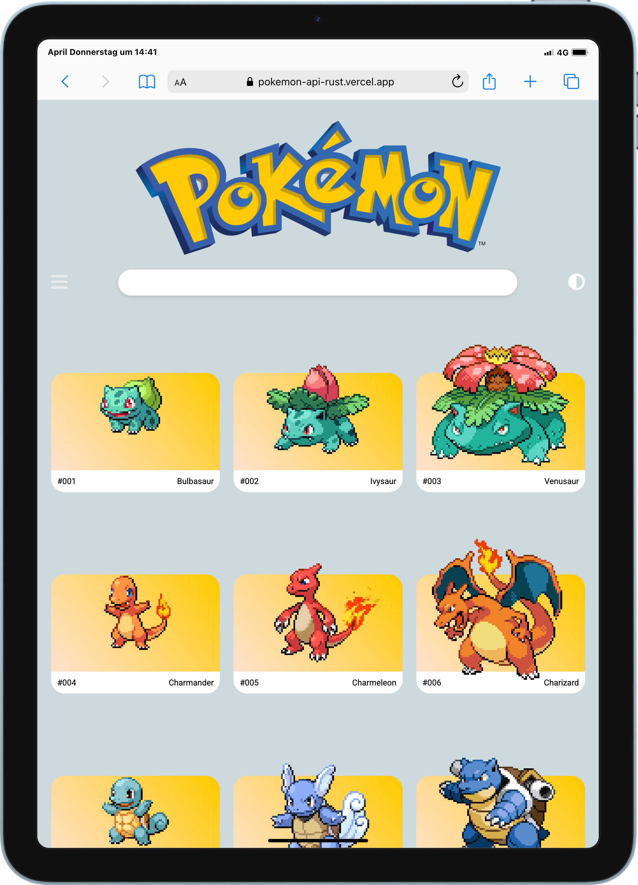

# Projekt: Pokémon API



## Übersicht
Dieses Projekt ist eine React-Anwendung, die die Pokémon-API nutzt, um Informationen über Pokémon anzuzeigen. Die Anwendung bietet folgende Hauptfunktionen:
- Durchsuchen und Filtern von Pokémon nach Typ.
- Anzeigen von Details zu einzelnen Pokémon.
- Abspielen von Pokémon-Sounds.
## Design
Das Design für die „Pokémon API“ wurde als Teil des Bootcamps bereitgestellt und mit Figma erstellt. Dieses Design diente als grobe Vorlage.
Das Design der Anwendung ist minimalistisch und benutzerfreundlich gestaltet. Es verwendet ein responsives Layout, das auf verschiedenen Bildschirmgrößen gut funktioniert. Die Hauptfarben orientieren sich an der Pokémon-Marke, mit einem Fokus auf Gelb, Rot und Blau. 

### Design-Elemente
- **Header:** Enthält das Logo und die Navigation.
- **Kartenlayout:** Pokémon werden in Kartenform dargestellt, die Informationen wie Name und Bild enthalten.
- **Detailansicht:** Zeigt zusätzliche Informationen in einem übersichtlichen Layout.
- **Farbschema:** Helle Farben mit klaren Kontrasten für bessere Lesbarkeit.

### Technologien
- **CSS Modules:** Für modulare und wartbare Styles.
- **Responsive Design:** Unterstützt Desktop- und Mobilgeräte.




## Deployment
Die Anwendung ist für eine einfache Bereitstellung auf Vercel konfiguriert. 

### Schritte zur Bereitstellung
1. Stelle sicher, dass alle Änderungen im Repository gepusht wurden.
2. Verknüpfe das Repository mit deinem Vercel-Konto.
3. Vercel erkennt automatisch die Vite-Konfiguration und erstellt die Anwendung.
4. Nach erfolgreicher Bereitstellung ist die Anwendung unter der von Vercel bereitgestellten URL verfügbar.

### Alternative Deployment-Optionen
- **Netlify:** Unterstützt ebenfalls Vite-Projekte und bietet ähnliche Funktionen wie Vercel.
- **Docker:** Erstelle ein Docker-Image und deploye es auf einer beliebigen Plattform.
## Voraussetzungen
- Node.js (Version 16 oder höher)
- npm oder ein anderer Paketmanager wie Yarn

## Installation
1. Klone das Repository:
    ```bash
    git clone https://github.com/MonaEis/pokemon_api.git
    cd pokemon_api
    ```

2. Installiere die Abhängigkeiten:
    ```bash
    npm install
    ```

3. Starte den Entwicklungsserver:
    ```bash
    npm run dev
    ```

4. Öffne die Anwendung im Browser unter [http://localhost:5173](http://localhost:5173).

## Funktionen
### 1. Startseite
- **URL:** `/`
- Zeigt eine Liste von Pokémon an.
- **Suchleiste:** Ermöglicht das Filtern von Pokémon nach Namen.
- **Klick auf ein Pokémon:** Öffnet die Detailseite des Pokémon.

### 2. Menüseite
- **URL:** `/menu`
- Zeigt eine Liste von Pokémon-Typen an.
- **Auswahl eines Typs:** Filtert die Pokémon-Liste auf der Startseite nach diesem Typ.

### 3. Detailseite
- **URL:** `/pokemon/:name`
- Zeigt Details zu einem Pokémon an, einschließlich:
  - Name
  - ID
  - Typen
  - Vorder- und Rückansicht des Pokémon
- **Klick auf das Bild:** Spielt den Pokémon-Sound ab.

## Deployment
Die Anwendung ist für Vercel konfiguriert. Um sie zu deployen:

1. Stelle sicher, dass die Datei `vercel.json` korrekt konfiguriert ist.
2. Führe den folgenden Befehl aus:
    ```bash
    vercel --prod
    ```

## Projektstruktur
Die wichtigsten Ordner und Dateien:
- **`src/pages`**: Enthält die Hauptseiten der Anwendung (HomePage, MenuPage, DetailPage).
- **`src/components`**: Wiederverwendbare Komponenten wie Header und PokemonCard.
- **`src/api`**: API-Funktionen für den Zugriff auf die Pokémon-API.
- **`src/types`**: Typdefinitionen für TypeScript.

## Tech Stack
- 
- 
- 
- 
- 
- 
- 

## Wichtige Abhängigkeiten
- React
- React Router DOM
- TypeScript
- Vite

## Bekannte Probleme
- **Ladezeiten:** Bei langsamer Internetverbindung kann das Laden der Pokémon-Daten länger dauern.
- **Sound-Fehler:** Wenn ein Pokémon-Sound nicht verfügbar ist, wird kein Ton abgespielt.

## Entwicklungsteam
Hao Lee
https://github.com/HAO-317

Elmin Hasanov
https://github.com/elmin-hasanov

Mona Eismann
https://github.com/MonaEis


Bei Fragen oder Problemen wende dich an das Entwicklungsteam.